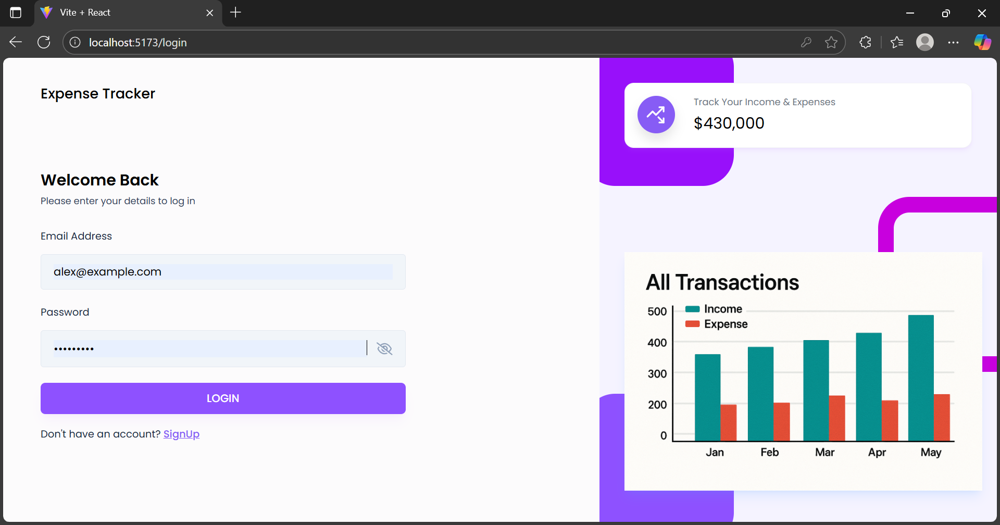
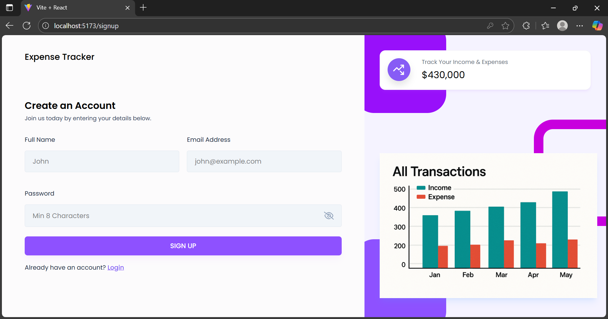
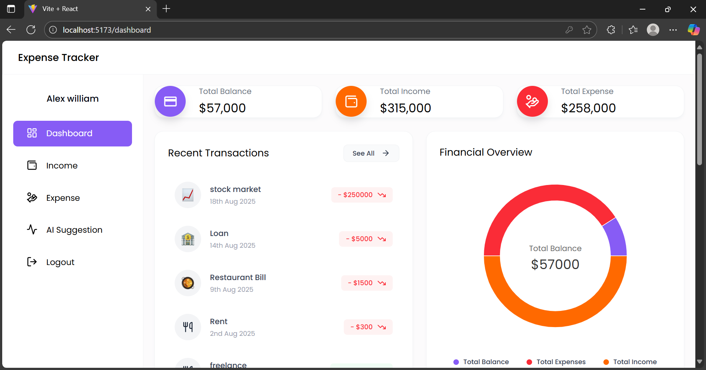
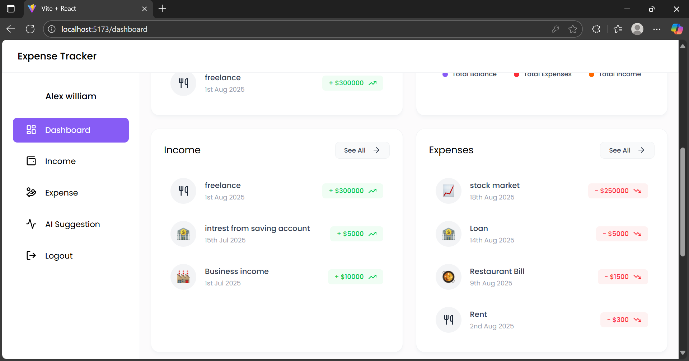
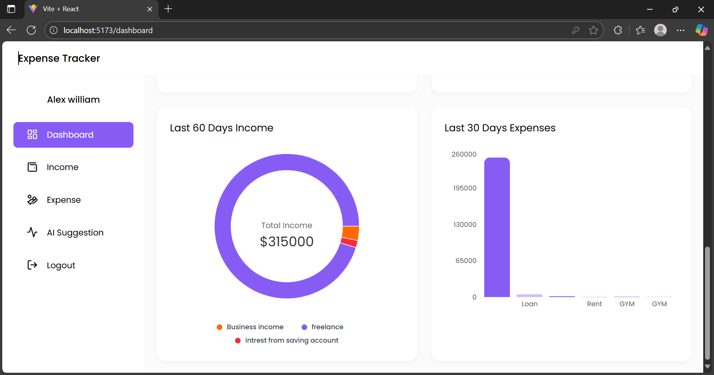
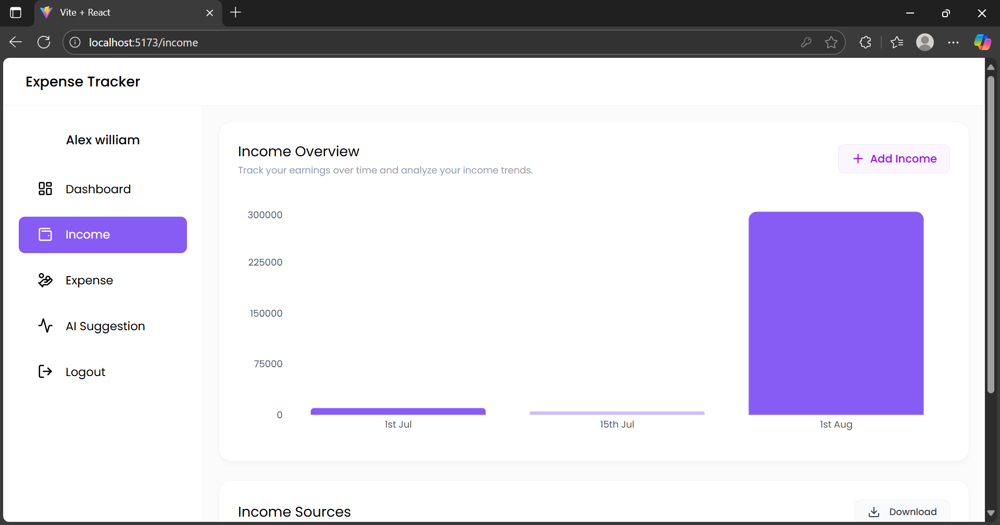
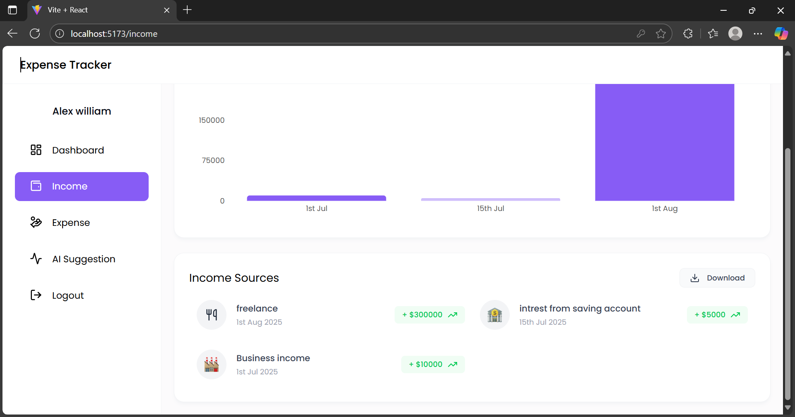
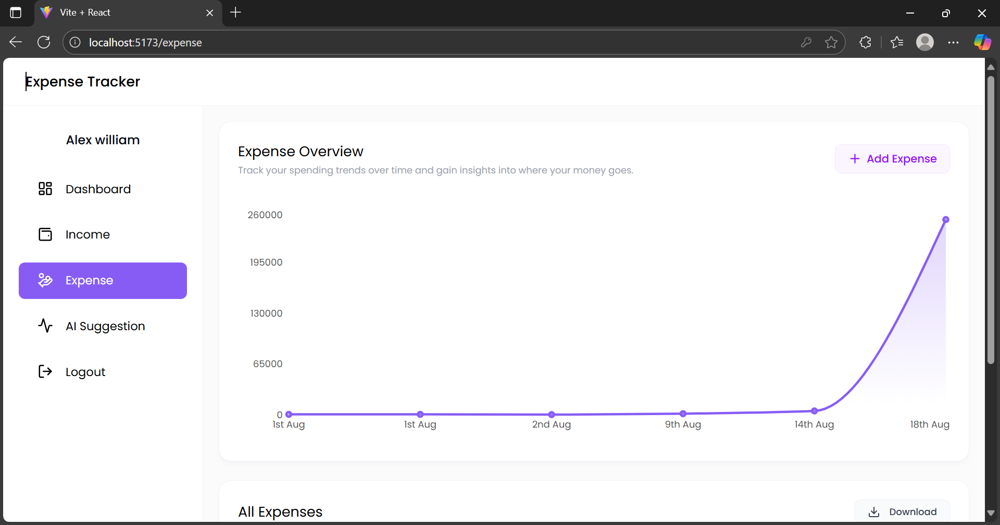
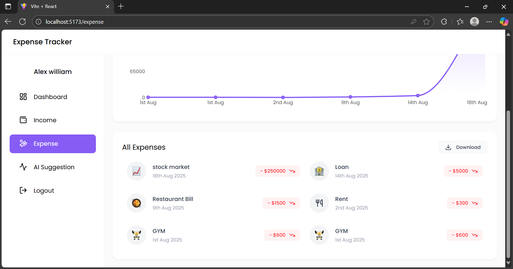
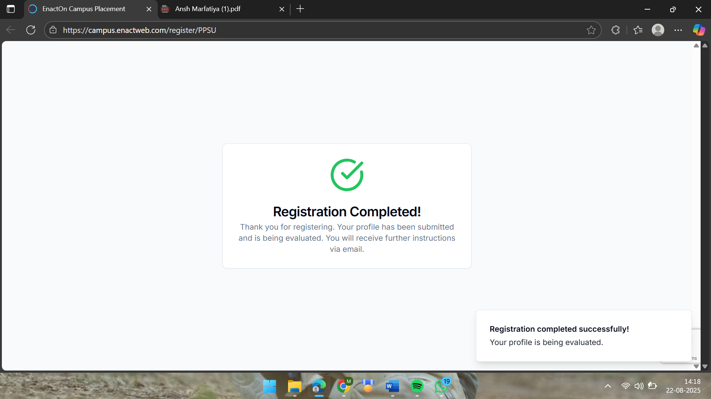

Expense Tracker App

A full-stack Expense Tracker Application built with React (frontend) and Node.js + Express + MongoDB (backend).

It helps users securely manage their income and expenses with charts, reports, and intuitive dashboards.

Author: Ansh Marfatiya

🔑 Features

User Authentication

Secure JWT-based Login & Sign-Up

Profile image upload and user info management

Dashboard Overview

Displays Total Balance, Income, and Expenses

Interactive summary cards

Income Management

Add, view, and delete income records

Export all income data to Excel

Expense Management

Add, view, and delete expense records

Category-based expense tracking

Export all expense data to Excel

Interactive Charts

Pie, Bar, and Line charts for financial insights

Track last 30 days’ expenses & last 60 days’ income

Recent Transactions

Quick access to latest income & expense records

Reports

Download Income & Expense Reports in Excel format

UI & UX

Mobile Responsive (desktop, tablet, mobile)

Sidebar navigation with Dashboard, Income, Expenses, and Logout

Delete functionality via hover actions

🖥️ Frontend

React with Tailwind CSS v4

API integration via Axios

Pages:

Login & Sign-Up

Dashboard

Income

Expenses

Components: Summary cards, Recent Transactions, Charts

⚙️ Backend

Node.js + Express server

MongoDB (Mongoose) for database

JWT Authentication for security

APIs:

Auth – Login, Sign-Up, Get User Info

Income – Add, View, Delete, Download Excel

Expense – Add, View, Delete, Download Excel

Dashboard – Fetch balance, income, expenses, and summary data

📁 Project Structure

expense-tracker/
├── frontend/
│   ├── src/
│   │   ├── components/
│   │   ├── pages/
│   │   ├── context/
│   │   └── apiPath.js
│   └── package.json
│

├── backend/
│   ├── controllers/
│   ├── models/
│   ├── routes/
│   ├── middlewares/
│   ├── server.js
│   └── package.json
│
└── README.md

🚀 How to Run
1. Clone the repository
git clone https://github.com/anshmarfatiya29/EXPENSE_TRACKERS.git
cd expense-tracker

2. Setup Backend
   
cd backend

npm install

Create .env file in backend with:

MONGO_URI=your_mongodb_connection_string

JWT_SECRET=your_secret_key

PORT=5000

npm start

3. Setup Frontend
   
cd frontend

npm install

npm start

4. Open in browser
   
http://localhost:XXXX

🛠️ Technologies Used

Frontend: React, Tailwind CSS, Axios

Backend: Node.js, Express.js, JWT, Multer (for profile images)

Database: MongoDB (Mongoose)

Charts: Recharts

📊 Screenshots

Login & Signup Page 

Dashboard Overview

Income Page

Expense Page

Reports Download

📄 License

This project is open-source and free to use for educational purposes.

